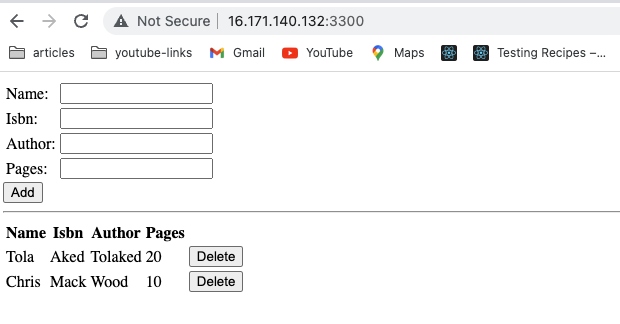

# DevOps-Training-Project4

# Project1

# STEP 1

- Install nodejs
  - run _sudo apt update_ to update ubuntu
  - run _sudo apt upgrade_ to upgrade ubuntu
  - run _sudo apt install -y nodejs_ to install nodejs
  - run _npm init_

# STEP 2

- Installing mongoDB

  - run _sudo apt-key adv --keyserver hkp://keyserver.ubuntu.com:80 --recv 0C49F3730359A14518585931BC711F9BA15703C6_
  - run **echo "deb [ arch=amd64 ] https://repo.mongodb.org/apt/ubuntu trusty/mongodb-org/3.4 multiverse" | sudo tee /etc/apt/sources.list.d/mongodb-org-3.4.list**
  - run _sudo apt install -y mongodb_ to install mongodb
  - run _sudo service mongodb start_ to start the server
  - run _sudo systemctl status mongodb_ to verify that the service is up and running.
  - run _sudo apt install -y npm_ install npm.
  - run _sudo npm install body-parser_ to install body-parser. A package that helps to process JSON files passed in requests to the server.
  - _mkdir Books && cd Books_
  - initialize a repo in Books _npm init_
  - Add server.js file in Books _vi server.js_ and paste the snippet below

  ```
    var express = require('express');
    var bodyParser = require('body-parser');
    var app = express();
    app.use(express.static(__dirname + '/public'));
    app.use(bodyParser.json());
    require('./apps/routes')(app);
    app.set('port', 3300);
    app.listen(app.get('port'), function() {
        console.log('Server up: http://localhost:' + app.get('port'));
    });
  ```

# STEP 3

- Install express and setup routes to the server
- run _sudo npm install express mongoose_ to install express and mongoose
- In Books folder _mkdir apps && cd apps_
- Create routes.js file _vi routes.js_ and paste the snippet below

  ```
        const Book = require('./models/book');

    module.exports = function(app){
    app.get('/book', function(req, res){
        Book.find({}).then(result => {
        res.json(result);
        }).catch(err => {
        console.error(err);
        res.status(500).send('An error occurred while retrieving books');
        });
    });

    app.post('/book', function(req, res){
        const book = new Book({
        name: req.body.name,
        isbn: req.body.isbn,
        author: req.body.author,
        pages: req.body.pages
        });
        book.save().then(result => {
        res.json({
            message: "Successfully added book",
            book: result
        });
        }).catch(err => {
        console.error(err);
        res.status(500).send('An error occurred while saving the book');
        });
    });

    app.delete("/book/:isbn", function(req, res){
        Book.findOneAndRemove(req.query).then(result => {
        res.json({
            message: "Successfully deleted the book",
            book: result
        });
        }).catch(err => {
        console.error(err);
        res.status(500).send('An error occurred while deleting the book');
        });
    });

    const path = require('path');
    app.get('*', function(req, res){
        res.sendFile(path.join(__dirname, 'public', 'index.html'));
    });
    };

  ```

  - In the apps folder create a folder named models _mkdir models && cd models_
  - Create a file named book.js _vi book.js_ and paste the snippet below

    ```
            var mongoose = require('mongoose');
        var dbHost = 'mongodb://localhost:27017/test';
        mongoose.connect(dbHost);
        mongoose.connection;
        mongoose.set('debug', true);
        var bookSchema = mongoose.Schema( {
        name: String,
        isbn: {type: String, index: true},
        author: String,
        pages: Number
        });
        var Book = mongoose.model('Book', bookSchema);
        module.exports = mongoose.model('Book', bookSchema);
    ```

```

```


# STEP 4

- Access the routes with AngularJS

  - Change the directory back to Books _cd../.._
  - Create a folder named pub,ic _mkdir public && cd public_
  - Add a file named script.js _vi script.js_ and add the snippet below.

  ```
    ar app = angular.module('myApp', []);
    app.controller('myCtrl', function($scope, $http) {
    $http( {
        method: 'GET',
        url: '/book'
    }).then(function successCallback(response) {
        $scope.books = response.data;
    }, function errorCallback(response) {
        console.log('Error: ' + response);
    });
    $scope.del_book = function(book) {
        $http( {
        method: 'DELETE',
        url: '/book/:isbn',
        params: {'isbn': book.isbn}
        }).then(function successCallback(response) {
        console.log(response);
        }, function errorCallback(response) {
        console.log('Error: ' + response);
        });
    };
    $scope.add_book = function() {
        var body = '{ "name": "' + $scope.Name +
        '", "isbn": "' + $scope.Isbn +
        '", "author": "' + $scope.Author +
        '", "pages": "' + $scope.Pages + '" }';
        $http({
        method: 'POST',
        url: '/book',
        data: body
        }).then(function successCallback(response) {
        console.log(response);
        }, function errorCallback(response) {
        console.log('Error: ' + response);
        });
    };
    });
  ```

  - In public folder, create a file named index.html _vi index.html_ paste the snippet below

  ```
  <!doctype html>
    <html ng-app="myApp" ng-controller="myCtrl">
    <head>
        <script src="https://ajax.googleapis.com/ajax/libs/angularjs/1.6.4/angular.min.js"></script>
        <script src="script.js"></script>
    </head>
    <body>
        <div>
        <table>
            <tr>
            <td>Name:</td>
            <td><input type="text" ng-model="Name"></td>
            </tr>
            <tr>
            <td>Isbn:</td>
            <td><input type="text" ng-model="Isbn"></td>
            </tr>
            <tr>
            <td>Author:</td>
            <td><input type="text" ng-model="Author"></td>
            </tr>
            <tr>
            <td>Pages:</td>
            <td><input type="number" ng-model="Pages"></td>
            </tr>
        </table>
        <button ng-click="add_book()">Add</button>
        </div>
        <hr>
        <div>
        <table>
            <tr>
            <th>Name</th>
            <th>Isbn</th>
            <th>Author</th>
            <th>Pages</th>

            </tr>
            <tr ng-repeat="book in books">
            <td>{{book.name}}</td>
            <td>{{book.isbn}}</td>
            <td>{{book.author}}</td>
            <td>{{book.pages}}</td>

            <td><input type="button" value="Delete" data-ng-click="del_book(book)"></td>
            </tr>
        </table>
        </div>
    </body>
    </html>
  ```

  - Change the directory back up to Books
  - start the server with _node server.js_


